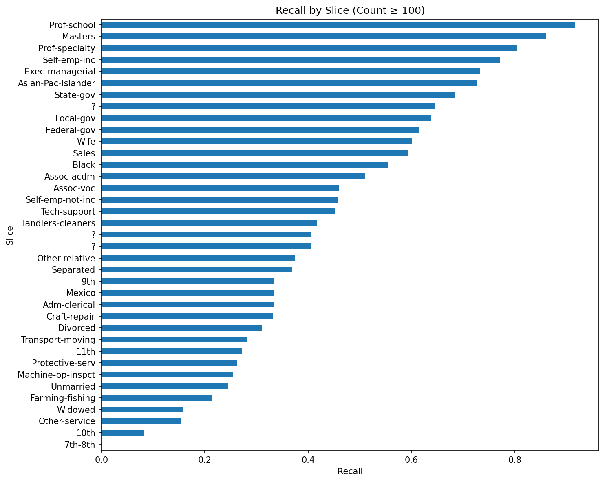
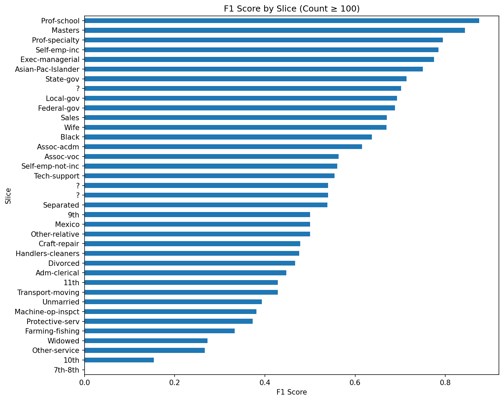

# Model Card: Census Income Classification Model

## Model Details 

This model predicts whether an individual earns > $50K per year using demographic and  employment data from the U.S. Census Adult dataset. It is a Random Forest  classifier trained with scikit‑learn as part of the *Deploying a Machine Learning Model  with FastAPI* project. The pipeline includes one‑hot encoding for categorical features,  label binarization for the target, and helper functions for training, inference, and  slice‑based evaluation. Artifacts saved include the trained model (model.pkl) and  encoder (encoder.pkl).

## Intended Use 

The model is intended for educational and demonstration purposes only to illustrate  reproducible ML pipelines, data preprocessing, model evaluation, and deployment. 

## Training Data 

The model was trained on the U.S. Census Adult dataset, which contains demographic and  employment attributes such as age, workclass, education, marital status, occupation,  race, sex, hours per week, and native country. Categorical features were one‑hot  encoded, and the target label (salary) was binarized. An 80/20 train–test split was  used.

## Evaluation Data 

Evaluation was performed on the held‑out test split from the same dataset. No additional external validation data was used. Slice‑based evaluation was conducted on the test set  across categorical features, with results written to slice_output.txt.

## Metrics 

The model was evaluated using precision, recall, and F1 score, consistent with the  project rubric. The model’s performance on the test set reflects a precision‑oriented  classifier that identifies high‑income individuals conservatively while missing a  portion of true positives.

* Precision: 0.7918 
* Recall: 0.5786 
* F1: 0.6686

Slice‑level evaluation was performed across categorical features. To focus on meaningful patterns, the visualizations below include only slices with at least 100 samples. Larger slices show stable behavior close to the overall metrics, while lower‑education and  service‑related groups exhibit reduced recall and F1. Very small slices were excluded because they produced misleading extremes (e.g., recall = 1.0) driven by tiny sample sizes rather than true model capability.

**Figure 1.** Recall across slices with ≥100 samples. 

**Figure 2.** F1 scores for slices with ≥100 samples. 

Higher‑education and professional‑occupation groups show stronger recall, while  lower‑education and service‑related slices exhibit reduced performance, reflecting  underlying dataset imbalances. Slices with clearer income patterns achieve higher F1,  while heterogeneous or lower‑education groups show lower overall performance.

## Ethical Considerations 

The dataset reflects historical socioeconomic patterns and contains demographic biases.  As a result, the model may underperform for certain groups or reinforce existing  disparities. Slice metrics highlight these issues but do not mitigate them. Any  real‑world use would require fairness analysis, bias mitigation, and domain‑expert  review.

## Caveats and Recommendations 

The model uses default hyperparameters and has not been optimized. Small slices produce unreliable metrics. The model assumes the same feature distribution as the training data and may not generalize to new populations. This model is for instructional use only.